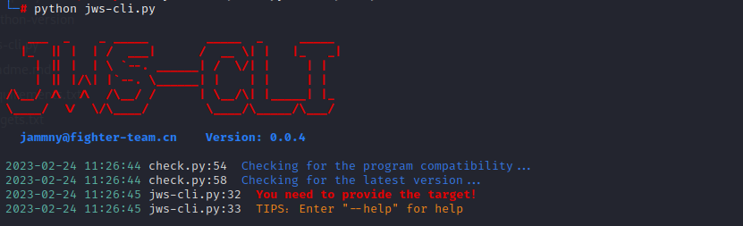
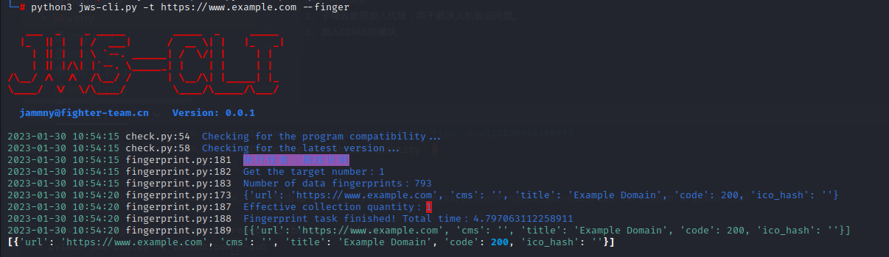
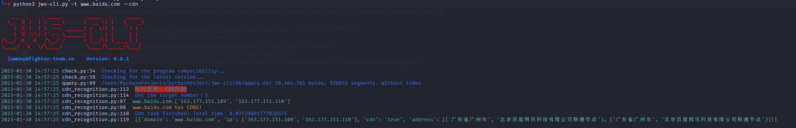
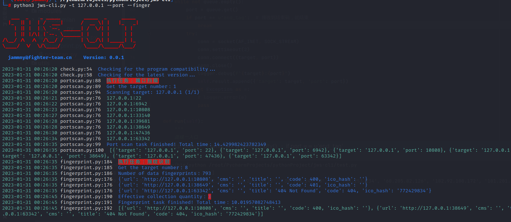

# JWS-CLI  

> 前言：目标是做一款全自动化信息收集工具，仅需一行命令就解放双手。为了提升脚本小子的编程能力，因此有了这个项目。

| 目标功能      | 完成状态 |
| ----- | ----------- |
| 子域名收集 | success |
| 指纹识别 | success |
| CDN识别 | success    |
| 端口扫描 | success    |
| C段扫描 | success    |
| POC扫描 | success    |

## 下载与部署 
1. 建议在kali下运行：`git clone https://github.com/jammny/jws-cli`

2. 初始化安装依赖：`python3 jws-cli.py`  




3. 自动化一键收集：`python3 jws-cli.py -t example.com --auto`  

## 域名收集

1. 默认情况下，使用内置的模块进行域名收集，具体模块包括：  

```angular2html
1、常用搜索引擎（12）：baidu、bing、fofa、google（国内镜像）、hunter、yandex、zoomeye、360so、sougou、fullhunt、binaryedge、censys  
2、威胁情报平台（2）: alienvault、virustotal  
3、开放的DNS数据集（10）：sitedossier、securitytrails、robtex、dnsdumpster、chinaz、rapiddns、ip138、riddler、qianxian、hackertarget  
4、SSL证书（2）：crtsh、certspotter  
5、支持基于字典的暴力破解， 支持置换扫描技术fuzz更多子域。  
6、支持DNS域传输漏洞检测。  
（模块说明：想使用更多的数据接口可以联系我更新。）
```

2. 有部分模块需要自行到文件`/db/config.yaml`配置API才能正常使用，绝大部分都是可以免费注册的：  


3. 常规使用：`python3 jws-cli.py -t example.com --sub`  


4、爆破域名模式，有两个爆破模块，目前耗时比较长：`python3 jws-cli.py -t target.com --sub --brute`

## 指纹识别

1. url指纹识别：`python3 jws-cli.py -t https://www.example.com --finger `  



2. 域名收集+指纹识别：`python3 jws-cli.py -t example.com --sub --finger`

## CDN识别

1. CDN识别：`python3 jws-cli.py -t example.com --cdn`



## 端口扫描

1. 可以在文件`/db/config.yaml`配置扫描参数：


2. 端口扫描+指纹识别：`python3 jws-cli.py -t example.com --port --finger`



3. 哦对了，端口扫描最好放到服务器上跑，比较稳定。

## C段扫描

1. C段扫描+指纹识别：`python3 jws-cli.py -t 192.168.2.1 --cidr --finger`


## POC扫描

1. 程序内置了一个poc扫描框架，但是目前能使用的poc较少，后续开放poc编写规则以及模板。
2. poc扫描： `python3 jws-cli.py -t http://example.com --poc`


3. 为了达到开箱即用的目的，现阶段支持使用第三方的扫描引擎：`afrog`， 在文件`/db/config.yaml`配置参数即可：


4. 调用afrog扫描：


# 报告输出
1. `/reports/`目录下会生成对应目标的html报告文件:


## 后续更新：
1. 子域收集将加入代理，用于解决人机验证问题。   
2. poc模块将兼容其他工具的poc，比如说：afrog。  
3. 将添加邮件通知、微信通知模块。
